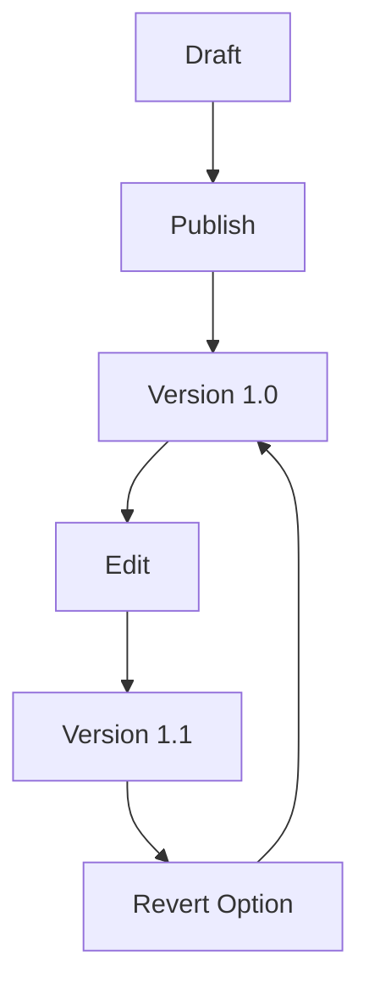

## Overview

HYPR provides a flexible platform for managing your documentation. You organize content into structured pages, collaborate with teams in real time, and track changes through version history. These core concepts form the foundation of effective documentation workflows.

<Columns cols={3}>
  <Card title="Document Organization" icon="folder" href="#document-organization">
    Structure your docs with folders, pages, and frontmatter for easy navigation.
  </Card>
  <Card title="Collaboration" icon="users" href="#collaboration">
    Share pages, invite contributors, and work together seamlessly.
  </Card>
  <Card title="Version Control" icon="git-branch" href="#version-control">
    Track changes, revert updates, and maintain history effortlessly.
  </Card>
</Columns>

## Document Organization

You structure your HYPR documentation using a hierarchical system of folders and MDX pages. Each page starts with YAML frontmatter for metadata, followed by markdown and JSX components.

<Steps>
  <Step title="Create Folders" icon="folder-plus">
    Organize content into logical folders like `core-concepts/` or `api-reference/`.
  </Step>
  <Step title="Add Pages" icon="file-plus">
    Create `.mdx` files with frontmatter:

````mdx
```yaml
---
title: My Page
description: Page summary
---
```
````

  </Step>
  <Step title="Link Pages" icon="link">
    Use relative links like `[Next Page](./next.mdx)` for navigation.
  </Step>
</Steps>

<Callout kind="tip">
  Use consistent naming conventions, such as kebab-case for file names (`core-concepts.mdx`), to improve searchability.
</Callout>

## Collaboration and Sharing

Invite team members to collaborate on HYPR docs. You control access levels and share pages publicly or privately.

<Tabs>
  <Tab title="Team Invite" icon="mail">
    Generate invite links:

    <CodeGroup tabs="cURL,JavaScript">
    ````bash
    curl -X POST https://api.hyprdocs.com/v1/invites \\
      -H "Authorization: Bearer YOUR_API_KEY" \\
      -d '{"email": "team@company.com", "role": "editor"}'
    ````
    ````javascript
    const response = await fetch('https://api.hyprdocs.com/v1/invites', {
      method: 'POST',
      headers: { 'Authorization': 'Bearer YOUR_API_KEY' },
      body: JSON.stringify({
        email: 'team@company.com',
        role: 'editor'
      })
    });
    ````
    </CodeGroup>
  </Tab>
  <Tab title="Public Share" icon="globe">
    Publish pages with a shareable URL. Set permissions to view-only for external stakeholders.
  </Tab>
</Tabs>

## Version History and Control

HYPR automatically saves versions for every change. You view diffs, restore previous states, and branch for experiments.



<ExpandableGroup>
  <Expandable title="Compare Versions" default-open="true">
    
| Version | Date       | Changes                  | Author     |
|---------|------------|--------------------------|------------|
| 1.1     | 2024-10-15 | Added collaboration tabs | alice@co.com |
| 1.0     | 2024-10-01 | Initial structure        | bob@co.com  |

    Use the history panel to select and compare any two versions side-by-side.
  </Expandable>
  <Expandable title="Branching Workflow">
    Create branches for major updates:

    <CodeGroup tabs="CLI,API">
    ````bash
    hypr branch create feature-login-docs
    hypr checkout feature-login-docs
    ````
    ````javascript
    await hyprClient.branches.create({
      name: 'feature-login-docs',
      base: 'main'
    });
    ````
    </CodeGroup>
  </Expandable>
</ExpandableGroup>

<Callout kind="info">
  Enable notifications in settings to get alerts on version updates from collaborators.
</Callout>