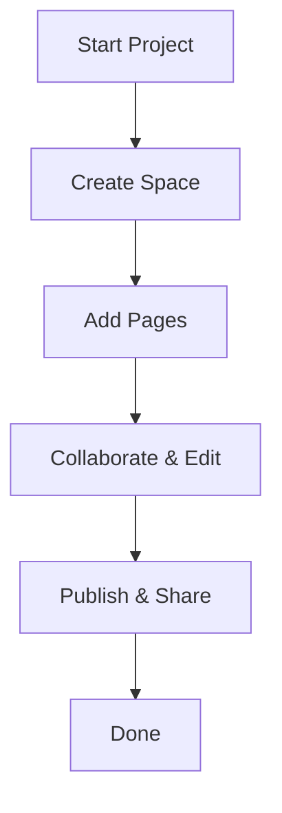

## Overview

HYPR Documentation provides a centralized platform where you create, organize, and publish your project's documentation. You build comprehensive guides, API references, and tutorials with an intuitive editor that supports real-time collaboration and version control. Access everything from a clean, searchable interface tailored to developers and teams.

## Key Features

HYPR offers powerful tools to streamline your documentation workflow. Explore the core capabilities below.

<Columns cols={3}>
  <Card title="Visual MDX Editor" icon="edit-3" href="/docs/editor">
    Write in Markdown with live previews and drag-and-drop components for rich, interactive pages.
  </Card>
  <Card title="Version Control" icon="git-branch" href="/docs/versions">
    Track changes, revert updates, and maintain release histories with Git-like branching.
  </Card>
  <Card title="Search & Navigation" icon="search" href="/docs/search">
    Full-text search across all docs with smart indexing and sidebar navigation.
  </Card>
</Columns>

<Callout kind="info">
  HYPR integrates seamlessly with your GitHub repo. Connect once to sync changes automatically.
</Callout>

## Benefits

You gain efficiency with these advantages:

- **Scalable Structure**: Organize docs into spaces, collections, and pages without limits.
- **Collaboration**: Invite team members for real-time edits and comments.
- **Custom Branding**: Apply your brand color like `#3B82F6` and logos across all pages.
- **Analytics**: Track page views and popular sections to refine content.

## Quick Start

Follow these steps to set up your first documentation space.

<Steps>
  <Step title="Create Account" icon="user-plus">
    Sign up at `https://app.hyprdocs.com` with your email or GitHub account.
  </Step>
  <Step title="New Space" icon="plus">
    Click "New Space" and name it for your project, like "API Reference".
  </Step>
  <Step title="Add Pages" icon="file-plus">
    Create pages using the MDX editor. Start with an `introduction.mdx` file.
  </Step>
  <Step title="Publish" icon="globe">
    Preview, then publish to generate a shareable URL.
  </Step>
</Steps>

## Navigation Guide

Navigate HYPR based on your role.

<Tabs>
  <Tab title="Developer" icon="code">
    Use the sidebar for API sections. Search for endpoints like `/users` to jump directly.

    ```javascript
    // Example: Fetch docs metadata
    const response = await fetch('https://api.hyprdocs.com/spaces/my-space/metadata');
    const docs = await response.json();
    console.log(docs.pages);
    ```
  </Tab>
  <Tab title="Team Lead" icon="users">
    Access analytics under "Insights". Review contributions and page performance.

    <CodeGroup tabs="JavaScript,Python">
    ```javascript
    import { HyprClient } from '@hypr/docs-sdk';
    const client = new HyprClient({ apiKey: 'YOUR_API_KEY' });
    const analytics = await client.spaces('my-space').analytics();
    ```
    ```python
    from hypr_docs import HyprClient
    client = HyprClient(api_key='YOUR_API_KEY')
    analytics = client.spaces('my-space').analytics()
    ```
    </CodeGroup>
  </Tab>
  <Tab title="Admin" icon="shield">
    Manage users and permissions in "Settings > Access".
  </Tab>
</Tabs>

## Advanced Customization

<Expandable title="Embed HYPR Docs in Your App" default-open="false">

Customize embeds with your brand.

```html
<iframe
  src="https://docs.hyprdocs.com/embed/my-space"
  style="border: none; width: 100%; height: 500px;"
  title="HYPR Documentation">
</iframe>
```

Set the primary color via API:

```javascript
await hyprClient.spaces('my-space').update({
  brandColor: '#3B82F6'
});
```

</Expandable>

## FAQ

<ExpandableGroup>
  <Expandable title="How do I import existing docs?">
    Upload Markdown files or connect your Git repo. HYPR auto-converts and structures them.
  </Expandable>
  <Expandable title="Is there a CLI?">
    Yes, install with `npm install -g @hypr/cli` and run `hypr docs sync`.
  </Expandable>
</ExpandableGroup>



You now have everything to master HYPR Documentation. Dive into specific guides next.