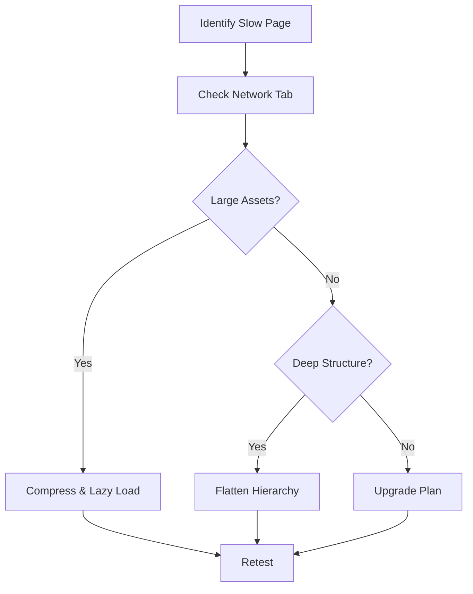

## Quick Troubleshooting Guide

<Callout kind="tip">
  Start with these common checks before diving into specific issues: Verify your internet connection, refresh the page, and clear your browser cache. Most problems resolve with a simple page reload.
</Callout>

<Columns cols={3}>
  <Card title="Sync Errors" icon="git-branch" href="#sync-errors">
    Fix Git sync and update failures quickly.
  </Card>
  <Card title="Permission Issues" icon="shield" href="#permissions">
    Resolve access denied errors.
  </Card>
  <Card title="Performance Tips" icon="zap" href="#performance">
    Optimize for faster loading.
  </Card>
</Columns>

## Sync and Update Errors

Sync issues often occur during Git pulls or pushes in your HYPR workspace. Follow these steps to diagnose and fix them.

<Steps>
  <Step title="Check Git Status" icon="terminal">
    Open your terminal and navigate to your project directory.

    ```bash
    cd /path/to/your/hypr-project
    git status
    ```

    Look for uncommitted changes or conflicts.
  </Step>
  <Step title="Stash Changes" icon="save">
    Temporarily save local changes.

    ```bash
    git stash push -m "WIP before sync"
    ```
  </Step>
  <Step title="Pull Latest" icon="download">
    Fetch and merge updates from HYPR.

    ```bash
    git pull origin main
    git stash pop
    ```
  </Step>
</Steps>

If conflicts persist, use the visual merge tool in your editor.

<CodeGroup tabs="Bash,PowerShell">
```bash
# Reset to clean state
git reset --hard origin/main
git clean -fd
```

```powershell
# PowerShell equivalent
git reset --hard origin/main
git clean -fd
```
</CodeGroup>

## Permission and Access Issues

You might see `access denied` or `403 Forbidden` errors when editing docs or inviting users.

### Common Causes and Fixes

<Tabs>
  <Tab title="Workspace Owner" icon="users">
    As owner, grant roles via the admin panel.

    <Steps>
      <Step title="Navigate to Settings">
        Go to Workspace `{settings}` > Members.
      </Step>
      <Step title="Assign Role">
        Select user > Role: `{editor}` or `{viewer}`.
      </Step>
    </Steps>
  </Tab>
  <Tab title="Browser Permissions" icon="globe">
    Clear site data or check extensions.

    ```bash
    # Check network requests in DevTools (F12)
    # Look for 403 responses
    ```

    <Callout kind="alert">
      Disable ad blockers for `hypr.docs` domain.
    </Callout>
  </Tab>
</Tabs>

<Expandable title="Advanced: API Token Reset" default-open="false">
  Generate a new token if using CLI.

  ```bash
  hypr auth logout
  hypr auth login --token YOUR_NEW_TOKEN
  ```
</Expandable>

## Performance Optimization

Slow page loads? Optimize your HYPR docs with these techniques.

| Issue | Symptom | Quick Fix |
|-------|---------|-----------|
| Large Images | Pages load >5s | Compress to `<500KB` |
| Deep Nesting | Scroll lag | Limit to 3 levels |
| Custom JS | Render delays | Minify scripts |

<Callout kind="success">
  Aim for Lighthouse scores `{>90}` on performance.
</Callout>

### Image Optimization Steps

<Steps>
  <Step title="Compress Images" icon="image">
    Use tools like TinyPNG before upload.
  </Step>
  <Step title="Lazy Load" icon="eye-off">
    Add `loading="lazy"` to images in MDX.
  </Step>
  <Step title="Purge CSS" icon="code">
    Run build with `{--purge}` flag.
  </Step>
</Steps>



For persistent issues, check HYPR status at `status.hypr.dev` or contact support with your workspace ID.